# Open-access health datasets for OLS linear regression practice

Curated teaching datasets for ordinary least squares. All 25 datasets are downloaded (or pulled from permissive R packages), column-renamed to tidy `snake_case`, saved as CSVs, and given a quick-view thumbnail.

All processing lives in [datasets_staging/scripts/prepare_datasets.R](scripts/prepare_datasets.R). Raw source files are in [datasets_staging/raw/](raw/), cleaned CSVs in [datasets_staging/cleaned/](cleaned/), and thumbnails in [datasets_staging/thumbnails/](thumbnails/).

## Summary tables

The 25 datasets fall into two natural groups. **Study datasets** are the raw data from a specific published research paper — the numbers you find in the resource correspond directly to the numbers analysed in that paper. **Teaching datasets** were curated, sampled, or aggregated specifically for a textbook or teaching package; they come from real public sources (NHANES, ACS, NCHS, UN, NLSY) but the rows/columns you see were selected for pedagogical convenience, not to reproduce a specific paper.

### A. Datasets from published research studies

| \# | Dataset | N × p | Outcome \~ main predictor | Quick view | R load | Cleaned CSV | License |
|---------|---------|---------|---------|---------|---------|-----------|---------|
| 1 | Body fat — 252 men (Johnson/Penrose) | 252 × 19 | `bodyfat_brozek` \~ `abdomen_cm` | 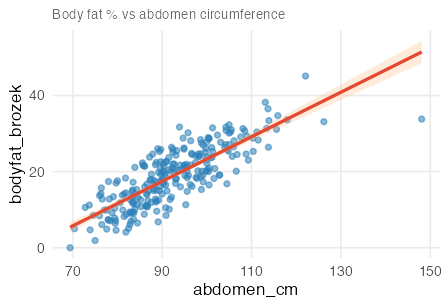 | `read.csv("cleaned/01_bodyfat_johnson.csv")` | [01_bodyfat_johnson.csv](cleaned/01_bodyfat_johnson.csv) | Free, non-commercial (Fisher/JSE) |
| 2 | Diabetes progression (Efron et al.) | 442 × 11 | `progression` \~ `bmi` | 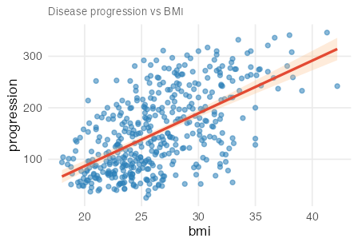 | `read.csv("cleaned/02_diabetes_efron.csv")` | [02_diabetes_efron.csv](cleaned/02_diabetes_efron.csv) | Public (scikit-learn default) |
| 3 | FEV lung function (Kahn/Tager) | 654 × 5 | `fev_l` \~ `height_in` | 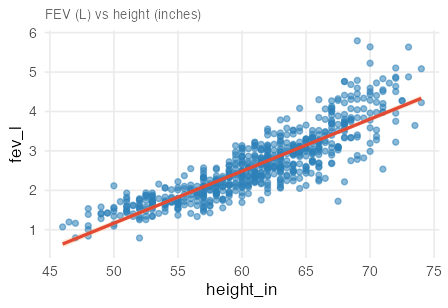 | `read.csv("cleaned/03_fev_kahn.csv")` | [03_fev_kahn.csv](cleaned/03_fev_kahn.csv) | Free, non-commercial (JSE) |
| 4 | Body fat — Spanish adults (Fuster-Parra) | 3200 × 5 | `bodyfat_pct` \~ `bmi` | 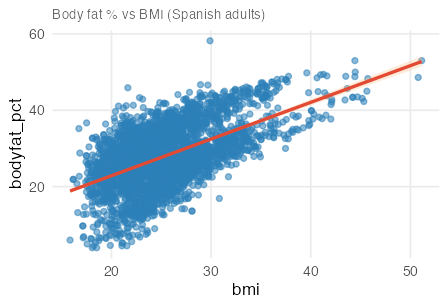 | `read.csv("cleaned/04_bodyfat_spanish.csv")` | [04_bodyfat_spanish.csv](cleaned/04_bodyfat_spanish.csv) | CC-BY 4.0 (PLOS ONE) |
| 5 | Birthweight from ultrasound (Secher) | 107 × 4 | `birthweight_g` \~ `abdominal_diameter_mm` | 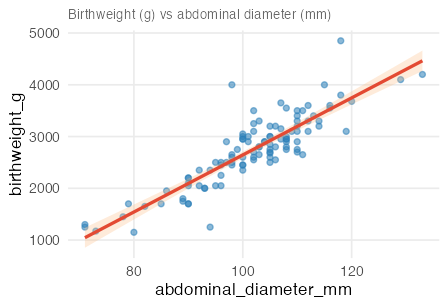 | `read.csv("cleaned/05_birthweight_secher.csv")` | [05_birthweight_secher.csv](cleaned/05_birthweight_secher.csv) | Textbook supplement (no explicit licence) |
| 6 | Peak power & tibial bone strength (Denys) | 142 × 8 | `bsi_compression` \~ `peak_power_w` | 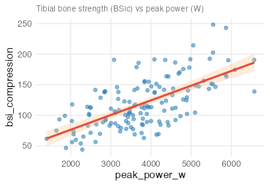 | `read.csv("cleaned/06_peak_power_bone.csv")` | [06_peak_power_bone.csv](cleaned/06_peak_power_bone.csv) | CC0 1.0 (Dryad) |
| 7 | Alcohol metabolism & sex (Frezza, NEJM) | 32 × 5 | `first_pass_metabolism` \~ `gastric_ad_activity` × `sex` | 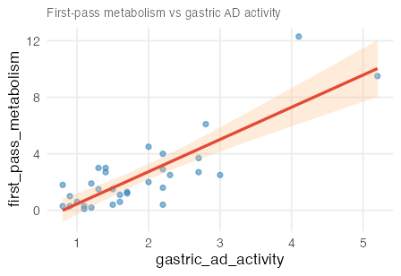 | `data(case1101, package = "Sleuth3")` | [07_alcohol_metabolism.csv](cleaned/07_alcohol_metabolism.csv) | GPL-2 (Sleuth3) |
| 8 | Cystic fibrosis lung function (O'Neill) | 25 × 10 | `pe_max` \~ `weight_kg` | 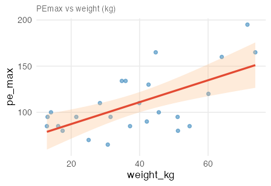 | `data(cystfibr, package = "ISwR")` | [08_cystic_fibrosis.csv](cleaned/08_cystic_fibrosis.csv) | GPL-2 (ISwR) |
| 9 | DXA body fat — German women (Garcia) | 71 × 10 | `dxa_fat_kg` \~ `waist_cm` | 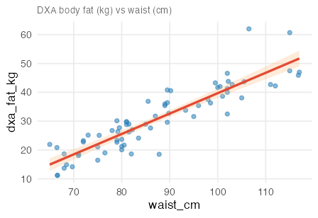 | `data(bodyfat, package = "TH.data")` | [09_bodyfat_german.csv](cleaned/09_bodyfat_german.csv) | GPL-2 (TH.data) |
| 10 | Birth weight — Baystate Medical (Hosmer) | 189 × 10 | `birthweight_g` \~ `mother_weight_lb` | 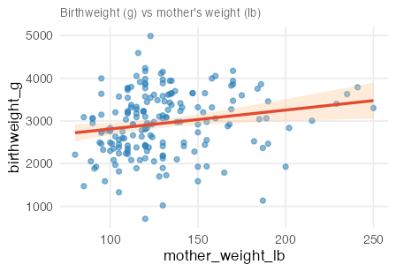 | `data(birthwt, package = "MASS")` | [10_birthweight_baystate.csv](cleaned/10_birthweight_baystate.csv) | GPL-2 (MASS) |
| 11 | HIV & 6-minute walk distance (Frasca) | 427 × 23 | `six_min_walk_m` \~ `age_yrs` | 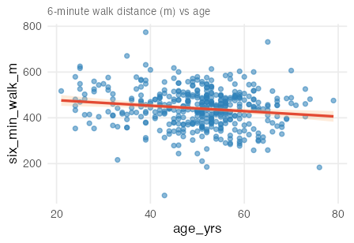 | `read.csv("cleaned/11_hiv_6mwt.csv")` | [11_hiv_6mwt.csv](cleaned/11_hiv_6mwt.csv) | CC0 1.0 (Dryad) |
| 12 | Serum GGT & atherosclerosis (BMJ Open) | 912 × 25 | `pwv_max` \~ `log2_ggt` | 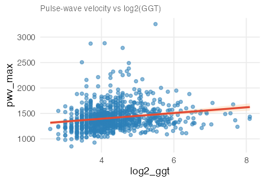 | `read.csv("cleaned/12_ggt_atherosclerosis.csv")` | [12_ggt_atherosclerosis.csv](cleaned/12_ggt_atherosclerosis.csv) | CC0 1.0 (Zenodo) |
| 13 | CV risk factors & CIMT in RA (Ozen) | 470 × 48 | `cimt_total` \~ `age_yrs` | 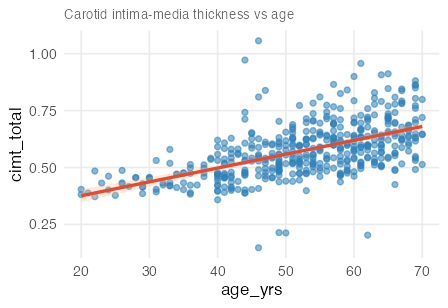 | `read.csv("cleaned/13_cimt_ra.csv")` | [13_cimt_ra.csv](cleaned/13_cimt_ra.csv) | CC0 1.0 (Zenodo) |
| 14 | Oral contraceptive use & prostate cancer (Margel) | 167 × 9 | `prostate_cancer_incidence` \~ `pill_use_pct` | 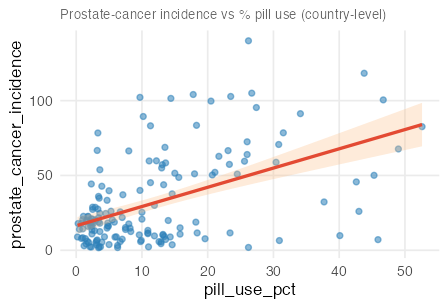 | `read.csv("cleaned/14_oc_prostate.csv")` | [14_oc_prostate.csv](cleaned/14_oc_prostate.csv) | CC0 1.0 (Dryad) |
| 15 | Patient activation for self-management (Bos-Touwen) | 1154 × 94 | `pam_activation_score` \~ `sf12_mental` | 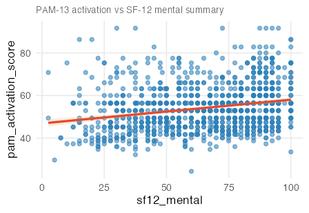 | `read.csv("cleaned/15_pam13.csv")` | [15_pam13.csv](cleaned/15_pam13.csv) | CC0 1.0 (Dryad) |
| 16 | Medical student resilience & QoL (Tempski) | 1350 × 22 | `whoqol_psychological` \~ `resilience_score` | 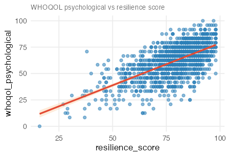 | `read.csv("cleaned/16_med_student_qol.csv")` | [16_med_student_qol.csv](cleaned/16_med_student_qol.csv) | CC0 1.0 (Dryad) |
| 17 | Depression & anxiety in older adults (Shenzhen) | 5331 × 24 | `phq9_depression_score` \~ `uls_loneliness_score` | 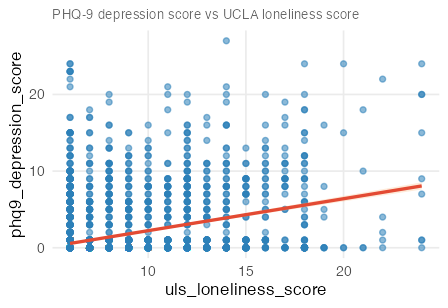 | `read.csv("cleaned/17_depression_anxiety.csv")` | [17_depression_anxiety.csv](cleaned/17_depression_anxiety.csv) | CC0 1.0 (Dryad) |
| 18 | PREVEND cognitive function & aging (NL cohort) | 500 × 31 | `rfft` \~ `age_yrs` | 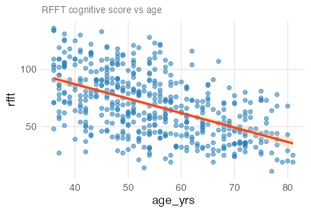 | `data(prevend.samp, package = "oibiostat")` | [18_prevend.csv](cleaned/18_prevend.csv) | No explicit licence (oibiostat) |
| 19 | FAMuSS — ACTN3 genotype & arm-strength gain | 595 × 9 | `ndrm_change_pct` \~ `age_yrs` | 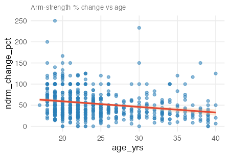 | `data(famuss, package = "oibiostat")` | [19_famuss.csv](cleaned/19_famuss.csv) | No explicit licence (oibiostat) |
| 25 | Boston housing — NOx air pollution (Harrison & Rubinfeld) | 506 × 13 | `nox_ppm_x10m` \~ `distance_to_employment` | 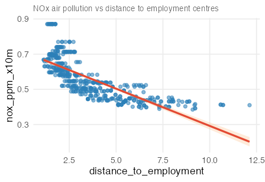 | `data(Boston, package = "ISLR2")` | [25_boston.csv](cleaned/25_boston.csv) | GPL-2 (ISLR2) |

### B. Teaching-oriented datasets (curated / sampled for pedagogy)

| \# | Dataset | N × p | Outcome \~ main predictor | Quick view | R load | Cleaned CSV | License |
|---------|---------|---------|---------|---------|---------|-----------|---------|
| 20 | kidiq — child test score & mother's IQ (ROS) | 434 × 5 | `kid_score` \~ `mom_iq` | 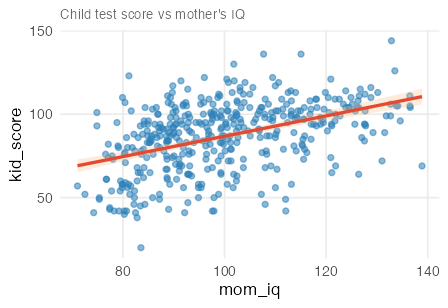 | `data(kidiq, package = "rosdata")` | [20_kidiq.csv](cleaned/20_kidiq.csv) | BSD-3 code; data licence unstated |
| 21 | births14 — US NCHS 2014 sample (openintro) | 1000 × 13 | `birthweight_lb` \~ `gestation_weeks` | 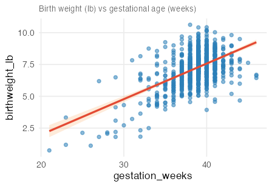 | `data(births14, package = "openintro")` | [21_births14.csv](cleaned/21_births14.csv) | CC-BY-SA 4.0 (openintro) |
| 22 | UN member states 2024 — global health (moderndive) | 193 × 13 | `life_expectancy_yrs` \~ `hdi` | 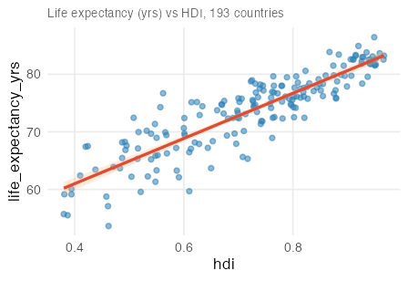 | `data(un_member_states_2024, package = "moderndive")` | [22_un_member_states_2024.csv](cleaned/22_un_member_states_2024.csv) | MIT (moderndive) |
| 23 | NHANES adult sample 2009–12 (oibiostat) | 135 × 31 | `systolic_bp` \~ `age_yrs` | 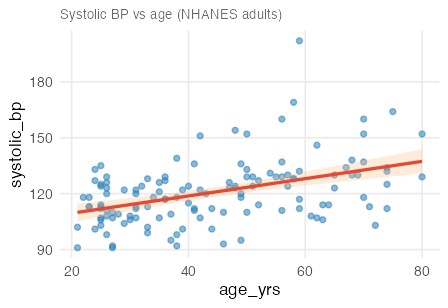 | `data(nhanes.samp.adult, package = "oibiostat")` | [23_nhanes_adult.csv](cleaned/23_nhanes_adult.csv) | NHANES public domain; oibiostat sample has no explicit licence |
| 24 | US county-level socio-economic data (usdata) | 3142 × 15 | `unemployment_rate` \~ `poverty_rate` | 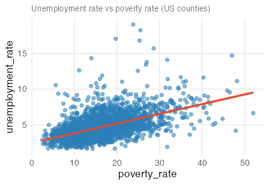 | `data(county, package = "usdata")` | [24_county.csv](cleaned/24_county.csv) | GPL-3 (usdata); Census/ACS public domain |

## Load-everything snippet

``` r
library(readr)

bodyfat_johnson     <- read_csv("cleaned/01_bodyfat_johnson.csv")
diabetes_efron      <- read_csv("cleaned/02_diabetes_efron.csv")
fev_kahn            <- read_csv("cleaned/03_fev_kahn.csv")
bodyfat_spanish     <- read_csv("cleaned/04_bodyfat_spanish.csv")
birthweight_secher  <- read_csv("cleaned/05_birthweight_secher.csv")
peak_power_bone     <- read_csv("cleaned/06_peak_power_bone.csv")
data(case1101, package = "Sleuth3");   alcohol_metabolism   <- case1101
data(cystfibr, package = "ISwR");      cystic_fibrosis      <- cystfibr
data(bodyfat,  package = "TH.data");   bodyfat_german       <- bodyfat
data(birthwt,  package = "MASS");      birthweight_baystate <- birthwt
hiv_6mwt            <- read_csv("cleaned/11_hiv_6mwt.csv")
ggt_atherosclerosis <- read_csv("cleaned/12_ggt_atherosclerosis.csv")
cimt_ra             <- read_csv("cleaned/13_cimt_ra.csv")
oc_prostate         <- read_csv("cleaned/14_oc_prostate.csv")
pam13               <- read_csv("cleaned/15_pam13.csv")
med_student_qol     <- read_csv("cleaned/16_med_student_qol.csv")
depression_anxiety  <- read_csv("cleaned/17_depression_anxiety.csv")
data(prevend.samp,         package = "oibiostat");  prevend              <- prevend.samp
data(famuss,               package = "oibiostat");  famuss_df            <- famuss
data(kidiq,                package = "rosdata");    kidiq_df             <- kidiq
data(births14,             package = "openintro");  births14_df          <- births14
data(un_member_states_2024, package = "moderndive"); un_member_states    <- un_member_states_2024
data(nhanes.samp.adult,    package = "oibiostat");  nhanes_adult         <- nhanes.samp.adult
data(county,               package = "usdata");     county_df            <- county
data(Boston,               package = "ISLR2");      boston_df            <- Boston
```

## Dataset details

Each section below lists the cleaned columns, primary paper/source, and the outcome + predictor used in the thumbnail. Column names in all cleaned CSVs use `snake_case`. Categorical variables are stored as factors with readable labels (e.g. `sex = male / female`) whenever the original coding was numeric.

------------------------------------------------------------------------

### 1 — Body fat, 252 men (Johnson/Penrose, JSE 1996)


-   **N × p:** 252 × 19
-   **Paper:** [Johnson 1996, DOI 10.1080/10691898.1996.11910505](https://doi.org/10.1080/10691898.1996.11910505)
-   **Original link:** [fat.dat.txt](http://jse.amstat.org/datasets/fat.dat.txt) ([docs](http://jse.amstat.org/datasets/fat.txt))
-   **License:** free for non-commercial use (Dr. A. Garth Fisher, BYU)
-   **Cleaned CSV:** [01_bodyfat_johnson.csv](cleaned/01_bodyfat_johnson.csv)
-   **Columns:** `case, bodyfat_brozek, bodyfat_siri, density, age, weight_lb, height_in, adiposity_bmi, fat_free_wt_lb, neck_cm, chest_cm, abdomen_cm, hip_cm, thigh_cm, knee_cm, ankle_cm, biceps_cm, forearm_cm, wrist_cm`
-   **Notes:** classic textbook OLS / variable-selection example. Known typos for cases 42, 48, 76, 96, 182.

------------------------------------------------------------------------

### 2 — Diabetes progression (Efron et al., Annals of Stats 2004)


-   **N × p:** 442 × 11
-   **Paper:** [Efron et al. 2004, DOI 10.1214/009053604000000067](https://doi.org/10.1214/009053604000000067)
-   **Original link:** [diabetes.tab.txt](https://www4.stat.ncsu.edu/~boos/var.select/diabetes.tab.txt)
-   **License:** public (scikit-learn ships it as its default regression example)
-   **Cleaned CSV:** [02_diabetes_efron.csv](cleaned/02_diabetes_efron.csv)
-   **Columns:** `age, sex, bmi, bp_mean, total_cholesterol, ldl, hdl, tc_hdl_ratio, log_serum_triglycerides, glucose, progression`
-   **Notes:** full-rank OLS reaches R² ≈ 0.51. Column renames mirror the LARS paper's `S1…S6`.

------------------------------------------------------------------------

### 3 — FEV lung function in youths (Kahn/Tager, JSE 2005)


-   **N × p:** 654 × 5
-   **Paper:** [Kahn 2005, DOI 10.1080/10691898.2005.11910559](https://doi.org/10.1080/10691898.2005.11910559)
-   **Original link:** [fev.dat.txt](http://jse.amstat.org/datasets/fev.dat.txt) ([docs](http://jse.amstat.org/datasets/fev.txt))
-   **License:** free for non-commercial use (JSE)
-   **Cleaned CSV:** [03_fev_kahn.csv](cleaned/03_fev_kahn.csv)
-   **Columns:** `age_yrs, fev_l, height_in, sex, smoke`
-   **Notes:** canonical confounding demo — naive smoker vs non-smoker comparison reverses sign once you adjust for age.

------------------------------------------------------------------------

### 4 — Body fat, Spanish adults (Fuster-Parra et al., PLOS ONE 2015)


-   **N × p:** 3,200 × 5
-   **Paper:** [Fuster-Parra et al. 2015, DOI 10.1371/journal.pone.0122291](https://doi.org/10.1371/journal.pone.0122291)
-   **Original link:** [PLOS supplementary S1](https://journals.plos.org/plosone/article/file?type=supplementary&id=10.1371/journal.pone.0122291.s001) (despite the `.xlsx` extension the file is a quoted text table)
-   **License:** CC-BY 4.0 (PLOS ONE supplements)
-   **Cleaned CSV:** [04_bodyfat_spanish.csv](cleaned/04_bodyfat_spanish.csv)
-   **Columns:** `age, sex, bai, bmi, bodyfat_pct`
-   **Notes:** paper explicitly uses OLS with asymptotic SEs. Gender originally coded 1 = male, 2 = female — decoded to a factor.

------------------------------------------------------------------------

### 5 — Birthweight from ultrasound (Secher, via Ekstrøm & Sørensen 2015)


-   **N × p:** 107 × 4
-   **Source:** Ekstrøm CT & Sørensen H, *Introduction to Statistical Data Analysis for the Life Sciences* (2015), textbook supplement
-   **Original link:** [BirthWeight.csv](https://staff.pubhealth.ku.dk/~linearpredictors/datafiles/BirthWeight.csv) (semicolon separator)
-   **License:** textbook supplement, publicly downloadable
-   **Cleaned CSV:** [05_birthweight_secher.csv](cleaned/05_birthweight_secher.csv)
-   **Columns:** `id, biparietal_diameter_mm, abdominal_diameter_mm, birthweight_g`
-   **Notes:** ideal first OLS example — two predictors only, clean linear relationship.

------------------------------------------------------------------------

### 6 — Peak power & tibial bone strength (Denys & Yingling, MSSE 2022)


-   **N × p:** 142 × 8 (79 female, 63 male)
-   **Paper:** [Denys et al., *Med Sci Sports Exerc* 2022, PMC9186462](https://pmc.ncbi.nlm.nih.gov/articles/PMC9186462/)
-   **Dryad:** [10.5061/dryad.0k6djhb14](https://datadryad.org/dataset/doi:10.5061/dryad.0k6djhb14)
-   **License:** CC0 1.0 (Dryad)
-   **Cleaned CSV:** [06_peak_power_bone.csv](cleaned/06_peak_power_bone.csv)
-   **Columns:** `subject_id, sex, age_bin, body_mass_kg, peak_power_w, relative_peak_power, bsi_compression, polar_strength_strain_index`
-   **Notes:** hierarchical OLS testing whether peak power (estimated from vertical-jump height via Sayer's equation) adds to body-mass prediction of tibial bone strength (`bsi_compression` for trabecular / `polar_strength_strain_index` for cortical). Gender decoded from 1 = female, 2 = male; `age_bin` kept as 1–6 (decade-wise bins from the original file).

------------------------------------------------------------------------

### 7 — Alcohol metabolism & sex (Frezza et al., NEJM 1990)


-   **N × p:** 32 × 5
-   **Paper:** [Frezza et al. 1990, DOI 10.1056/NEJM199001113220205](https://doi.org/10.1056/NEJM199001113220205)
-   **Source:** `Sleuth3::case1101`
-   **License:** GPL-2 (via Sleuth3)
-   **Load:** `data(case1101, package = "Sleuth3")`
-   **Cleaned CSV:** [07_alcohol_metabolism.csv](cleaned/07_alcohol_metabolism.csv)
-   **Columns:** `subject, first_pass_metabolism, gastric_ad_activity, sex, alcohol_status`
-   **Notes:** landmark NEJM study — great for teaching interactions (sex × gastric activity).

------------------------------------------------------------------------

### 8 — Cystic fibrosis lung function (O'Neill 1983)


-   **N × p:** 25 × 10
-   **Paper:** O'Neill et al. (1983), *American Review of Respiratory Disease*, 128:1051.
-   **Source:** `ISwR::cystfibr`
-   **License:** GPL-2 (via ISwR)
-   **Load:** `data(cystfibr, package = "ISwR")`
-   **Cleaned CSV:** [08_cystic_fibrosis.csv](cleaned/08_cystic_fibrosis.csv)
-   **Columns:** `age_yrs, sex, height_cm, weight_kg, bmp_pct, fev1_pct, residual_volume, functional_residual_capacity, total_lung_capacity, pe_max`
-   **Notes:** small-sample OLS with 9 clinical predictors — good for stepwise selection / multicollinearity discussion.

------------------------------------------------------------------------

### 9 — DXA body fat, German women (Garcia et al., Obesity 2005)


-   **N × p:** 71 × 10
-   **Paper:** [Garcia et al. 2005, DOI 10.1038/oby.2005.67](https://doi.org/10.1038/oby.2005.67)
-   **Source:** `TH.data::bodyfat`
-   **License:** GPL-2 (via TH.data)
-   **Load:** `data(bodyfat, package = "TH.data")`
-   **Cleaned CSV:** [09_bodyfat_german.csv](cleaned/09_bodyfat_german.csv)
-   **Columns:** `age_yrs, dxa_fat_kg, waist_cm, hip_cm, elbow_breadth_cm, knee_breadth_cm, anthro_3a, anthro_3b, anthro_3c, anthro_4`
-   **Notes:** DXA is the gold-standard outcome. Paper uses backward-elimination OLS.

------------------------------------------------------------------------

### 10 — Birth weight, Baystate Medical (Hosmer & Lemeshow 1989)


-   **N × p:** 189 × 10
-   **Source reference:** Hosmer DW & Lemeshow S, *Applied Logistic Regression* (1989)
-   **Source:** `MASS::birthwt` (also mirrored as [Rdatasets CSV](https://vincentarelbundock.github.io/Rdatasets/csv/MASS/birthwt.csv))
-   **License:** GPL-2 (via MASS)
-   **Load:** `data(birthwt, package = "MASS")`
-   **Cleaned CSV:** [10_birthweight_baystate.csv](cleaned/10_birthweight_baystate.csv)
-   **Columns:** `birthweight_g, low_birthweight, mother_age_yrs, mother_weight_lb, race, smoked_during_pregnancy, previous_premature_labours, history_hypertension, uterine_irritability, physician_visits_1st_trimester`
-   **Notes:** classic logistic-regression dataset but `birthweight_g` is routinely re-used for OLS teaching. Race decoded from 1/2/3 to `white/black/other`; binary flags converted to `logical`.

------------------------------------------------------------------------

### 11 — HIV & 6-minute walk test (Frasca et al., PLOS ONE 2019)


-   **N × p:** 427 × 23
-   **Paper:** [Frasca et al. 2019, DOI 10.1371/journal.pone.0212975](https://journals.plos.org/plosone/article?id=10.1371/journal.pone.0212975)
-   **Dryad:** [10.5061/dryad.nf63rb8](https://datadryad.org/dataset/doi:10.5061/dryad.nf63rb8)
-   **License:** CC0 1.0 (Dryad)
-   **Cleaned CSV:** [11_hiv_6mwt.csv](cleaned/11_hiv_6mwt.csv)
-   **Columns:** `hiv_status, age_yrs, sex, cd4_count, pack_years, on_antiretroviral, systolic_bp_pre, diastolic_bp_pre, six_min_walk_m, mmrc_dyspnoea, sgrq_symptoms, sgrq_activity, sgrq_impacts, sgrq_total, haemoglobin, viral_load_detectable, post_fvc_pct_pred, dlco_pct_pred, post_fev1_pct_pred, post_fev1_fvc_ratio, viral_load_copies, smoking_status, drug_use`
-   **Notes:** continuous outcome (distance walked in 6 minutes); works as a single-predictor OLS demo and as a richer multivariable model controlling for HIV status + lung function.

------------------------------------------------------------------------

### 12 — Serum γ-GTP & atherosclerosis (BMJ Open 2014)


-   **N × p:** 912 × 25
-   **Paper:** [BMJ Open 2014](https://bmjopen.bmj.com/content/4/10/e005413)
-   **Zenodo:** [record 4946112](https://zenodo.org/records/4946112)
-   **License:** CC0 1.0 (Zenodo)
-   **Cleaned CSV:** [12_ggt_atherosclerosis.csv](cleaned/12_ggt_atherosclerosis.csv)
-   **Columns:** `id, age, bmi, systolic_bp, diastolic_bp, ast, alt, ggt, log2_ggt, fasting_glucose, uric_acid, total_cholesterol, triglycerides, hdl_cholesterol, ldl_cholesterol, current_smoker, ex_smoker, alcohol_use, exercise, fatty_liver, egfr, post_menopausal, abi_max, pwv_max, sex`
-   **Notes:** cross-sectional health-check data; many plausible continuous outcomes (PWVmax, ABImax, cIMT surrogates).

------------------------------------------------------------------------

### 13 — CV risk factors & carotid intima-media thickness in RA (PLOS ONE 2015)


-   **N × p:** 470 × 48
-   **Paper:** [Ozen et al., PLOS ONE 2015](https://journals.plos.org/plosone/article?id=10.1371/journal.pone.0140844)
-   **Zenodo:** [record 4961200](https://zenodo.org/records/4961200)
-   **License:** CC0 1.0 (Zenodo)
-   **Cleaned CSV:** [13_cimt_ra.csv](cleaned/13_cimt_ra.csv)
-   **Columns (48):** `id, sex, age_yrs, bmi, waist_cm, systolic_bp, diastolic_bp, total_cholesterol, hdl_cholesterol, ldl_cholesterol, triglycerides, crp, smoking, hypertension, statins, ra, das28_bse, das28_crp, cimt_total, anti_ccp, apo_b_vnumber, plaques, ra_4_groups, ra_healthy, ra_ht_hc, ra_ldl_cat, hx_hypertension, antihypertensives, hx_dyslipidaemia, height_cm, weight_kg, prednisone, glucose, apo_a, apo_b, cv_risk, rheumatoid_factor, erosive_ra, ra_disease_duration, ldl_cutoff_2_5, nsaid, hydroxychloroquine, sulfasalazine, methotrexate, leflunomide, anti_tnf, other_biologicals, azathioprine`
-   **Notes:** SPSS `.sav` file — `haven::read_sav()` + `zap_labels()` gives a clean tibble. Mixed Dutch/English column names cleaned up.

------------------------------------------------------------------------

### 14 — Oral-contraceptive use & prostate cancer (Margel & Fleshner, BMJ Open 2011)


-   **N × p:** 167 × 9
-   **Paper:** [Margel & Fleshner, BMJ Open 2011](https://bmjopen.bmj.com/content/1/2/e000311)
-   **Dryad:** [10.5061/dryad.ff6bd0pq](https://datadryad.org/dataset/doi:10.5061/dryad.ff6bd0pq)
-   **License:** CC0 1.0 (Dryad)
-   **Cleaned CSV:** [14_oc_prostate.csv](cleaned/14_oc_prostate.csv)
-   **Columns:** `country, gdp_usd, prostate_cancer_incidence, prostate_cancer_mortality, pill_use_pct, iud_use_pct, condom_use_pct, vaginal_barrier_use_pct, europe`
-   **Notes:** ecological (country-level) data — one row per country. Several numeric columns arrived as strings in the original `.xls` and are coerced to numeric on import.

------------------------------------------------------------------------

### 15 — Patient activation for self-management (Bos-Touwen et al., PLOS ONE 2015)


-   **N × p:** 1,154 × 94
-   **Paper:** [Bos-Touwen et al., PLOS ONE 2015](https://journals.plos.org/plosone/article?id=10.1371/journal.pone.0126400)
-   **Dryad:** [10.5061/dryad.jg413](https://datadryad.org/dataset/doi:10.5061/dryad.jg413) (SPSS `.sav` + README)
-   **License:** CC0 1.0 (Dryad)
-   **Cleaned CSV:** [15_pam13.csv](cleaned/15_pam13.csv)
-   **Outcome of interest:** `pam_activation_score` (continuous 0–100 PAM-13 score). Also `pam_level` 1–4.
-   **Key predictors:** `sf12_physical`, `sf12_mental`, `hads_depression`, `hads_anxiety`, `ipq_total`, `support_total`, `charlson_index`, `age_yrs`, `bmi`, `disease`, `education_level`, `financial_distress`.
-   **All 94 columns:** identifier/demographics first — `subject_id, sex, age_yrs, bmi, height_cm, weight_kg, education_level, living_situation, financial_distress, smoking_code, disease, disease_severity, disease_duration_yrs, n_comorbidities, charlson_index` — then derived scores (`pam_activation_score, pam_level, sf12_total, sf12_physical, sf12_mental, hads_depression, hads_anxiety, ipq_total, support_family, support_friends, support_significant_other, support_total, egfr, egfr_ml_min, nyha, nyha_class, gold_stage, ethnicity_code, care_allowance, dm_medication`), then the raw item-level scales `pam1…pam13, sf1…sf12, hads1…hads14, ipq1…ipq8, ssup1…ssup12`.
-   **Notes:** multiple linear regression on PAM-13 as outcome. The item-level columns let you reconstruct subscales or play with item-response modelling.

------------------------------------------------------------------------

### 16 — Medical student resilience & QoL (Tempski et al., PLOS ONE 2015)


-   **N × p:** 1,350 × 22
-   **Paper:** [Tempski et al., PLOS ONE 2015](https://journals.plos.org/plosone/article?id=10.1371/journal.pone.0131535)
-   **Dryad:** [10.5061/dryad.63r07](https://datadryad.org/dataset/doi:10.5061/dryad.63r07)
-   **License:** CC0 1.0 (Dryad)
-   **Cleaned CSV:** [16_med_student_qol.csv](cleaned/16_med_student_qol.csv)
-   **Columns:** `subject_id, sex, group, overall_qol, medical_school_qol, whoqol_physical, whoqol_psychological, whoqol_social, whoqol_environment, dreem_learning, dreem_teachers, dreem_academic_self_perception, dreem_atmosphere, dreem_social_self_perception, dreem_global, resilience_score, bdi, age_yrs, school_legal_status, school_location, state_anxiety, trait_anxiety`
-   **Notes:** the original Excel file has a title banner on row 1 and real headers on row 2 — the script reads with `skip = 1`. Outcome is any of the WHOQOL/DREEM subscales; predictors include `resilience_score`, `bdi`, `state_anxiety`, `trait_anxiety`.

------------------------------------------------------------------------

### 17 — Depression & anxiety in older adults, Shenzhen (BMJ Open 2024)


-   **N × p:** 5,331 × 24
-   **Paper:** [BMJ Open 2024, article e077078](https://bmjopen.bmj.com/content/14/2/e077078)
-   **Dryad:** [10.5061/dryad.bnzs7h4j1](https://datadryad.org/dataset/doi:10.5061/dryad.bnzs7h4j1)
-   **License:** CC0 1.0 (Dryad)
-   **Cleaned CSV:** [17_depression_anxiety.csv](cleaned/17_depression_anxiety.csv)
-   **Columns:** `subject_code, education_level, marital_status, has_chronic_disease, income_level, drinking_status, smoking_status, self_rated_health, sleep_hours, phq9_depression_score, gad7_anxiety_score, isi_insomnia_score, ad8_cognitive_score, csid_cognitive_score, uls_loneliness_score, depressive_symptoms, anxiety_symptoms, mild_cognitive_impairment, early_dementia, insomnia, marital_status_code, has_chronic_disease_code, drinking_code, smoking_code`
-   **Notes:** all the categorical codes documented in the Dryad README are decoded here into labelled factors (education 1–5 → `primary_or_below…master_plus`, drinking 1–3 → `non_drinker / ex_drinker / current_drinker`, etc.). Binary symptom flags are stored as `logical`. The original numeric codes are retained as `*_code` columns so anyone wanting to reproduce the paper's exact regressions can still use them.

------------------------------------------------------------------------

### 18 — PREVEND cognitive function & aging (Dutch cohort, via `oibiostat`)


-   **N × p:** 500 × 31 (random sub-sample of the 4,095-participant PREVEND cohort)
-   **Study:** Prevention of REnal and Vascular ENd-stage Disease (PREVEND), University Medical Center Groningen. See the [oibiostat data docs](https://github.com/OI-Biostat/oi_biostat_data) and Joosten et al. 2014 ([PMC4086841](https://pmc.ncbi.nlm.nih.gov/articles/PMC4086841/)).
-   **Source:** `oibiostat::prevend.samp`
-   **License:** `oibiostat` has no explicit licence (its DESCRIPTION says *"No licensing yet"*); the underlying PREVEND data are governed by UMC Groningen. Redistribution is legally gray — intended for teaching alongside the OpenIntro Biostatistics textbook.
-   **Load:** `data(prevend.samp, package = "oibiostat")`
-   **Cleaned CSV:** [18_prevend.csv](cleaned/18_prevend.csv)
-   **Columns:** `subject_id, sex, age_yrs, ethnicity, education, rfft, bmi, systolic_bp, diastolic_bp, mean_arterial_pressure, egfr, total_cholesterol, hdl_cholesterol, cvd, diabetes, hypertension, smoking_status, statin_user, framingham_risk_score, vat, albuminuria_v1, albuminuria_v2, statin_solubility_code, days_on_statin, years_on_statin, defined_daily_dose, propensity_score, propensity_quintile, genetic_risk_score, match_id_1, match_id_2`
-   **Notes:** `rfft` = Ruff Figural Fluency Test score, an executive-function measure. Teaching uses include simple OLS (`rfft ~ age_yrs`), education as a confounder (`rfft ~ age_yrs + education`), and statin-use effects on cognition. Integer code columns (`gender_code`, `ethnicity_code`, `education_code`, `smoking_code`) were decoded into the factors `sex`, `ethnicity`, `education`, `smoking_status`; binary flags are stored as `logical`.

------------------------------------------------------------------------

### 19 — FAMuSS — ACTN3 genotype & resistance training (via `oibiostat`)


-   **N × p:** 595 × 9
-   **Study:** Functional SNPs Associated with Muscle Size and Strength (FAMuSS), University of Massachusetts. Classic genetic-epidemiology training dataset; see Thompson et al. 2004 ([DOI 10.1249/01.mss.0000142301.87942.76](https://doi.org/10.1249/01.MSS.0000142301.87942.76)).
-   **Source:** `oibiostat::famuss`
-   **License:** `oibiostat` has no explicit licence — see row 18 note.
-   **Load:** `data(famuss, package = "oibiostat")`
-   **Cleaned CSV:** [19_famuss.csv](cleaned/19_famuss.csv)
-   **Columns:** `ndrm_change_pct, drm_change_pct, sex, age_yrs, race, height_in, weight_lb, actn3_genotype, bmi`
-   **Notes:** outcome is % change in non-dominant arm strength after 12 weeks of supervised resistance training. Great for teaching categorical predictors (`actn3_genotype` = CC / CT / TT) + confounders (`sex`, `age_yrs`, `race`, `bmi`).

------------------------------------------------------------------------

### 20 — kidiq — child test score & mother's IQ (Regression and Other Stories)


-   **N × p:** 434 × 5
-   **Source:** Gelman, Hill & Vehtari, *Regression and Other Stories* (2020) — [kidiq dataset](https://avehtari.github.io/ROS-Examples/KidIQ/kidiq.html)
-   **Package:** `rosdata::kidiq` (from [avehtari/ROS-Examples](https://github.com/avehtari/ROS-Examples), install via `remotes::install_github("avehtari/ROS-Examples", subdir = "rpackage")`)
-   **License:** `rosdata` DESCRIPTION says *"Code BSD-3 + for data see each data source directory"* — but those directories don't contain data licences. Underlying NLSY data are public. Redistribution is legally gray outside of teaching contexts.
-   **Load:** `data(kidiq, package = "rosdata")`
-   **Cleaned CSV:** [20_kidiq.csv](cleaned/20_kidiq.csv)
-   **Columns:** `kid_score, mom_iq, mom_high_school, mom_work, mom_age_yrs`
-   **Notes:** canonical first-week multiple-regression example — `kid_score ~ mom_iq + mom_high_school` with an interaction term demonstrates how education modifies the IQ–score slope.

------------------------------------------------------------------------

### 21 — births14 — US NCHS 2014 live births (via `openintro`)


-   **N × p:** 1,000 × 13 (random sample of US live births in 2014)
-   **Source:** [US CDC National Center for Health Statistics, 2014 natality file](https://www.cdc.gov/nchs/data_access/vitalstatsonline.htm); redistributed in `openintro::births14`.
-   **License:** CC-BY-SA 4.0 (via openintro textbook)
-   **Load:** `data(births14, package = "openintro")`
-   **Cleaned CSV:** [21_births14.csv](cleaned/21_births14.csv)
-   **Columns:** `father_age_yrs, mother_age_yrs, mother_maturity, gestation_weeks, premature, prenatal_visits, weight_gain_lb, birthweight_lb, low_birthweight, sex, smoking_habit, marital_status, white_mother`
-   **Notes:** much larger and more recent than the other two birth-weight datasets (rows 5 and 10). Rich multivariable OLS: `birthweight_lb ~ gestation_weeks + mother_age_yrs + prenatal_visits + weight_gain_lb + smoking_habit`. Binary outcome `premature` / `low_birthweight` are also useful contrasts for logistic regression.

------------------------------------------------------------------------

### 22 — UN member states 2024 — global-health indicators (via `moderndive`)


-   **N × p:** 193 × 13 (one row per UN member state)
-   **Source:** compiled by the [ModernDive](https://moderndive.com/) authors from UN, World Bank, UNDP and WHO data; shipped in the development version of `moderndive` (≥ 0.7.0).
-   **License:** MIT (redistributed via `moderndive`); underlying data: UN / World Bank / UNDP (mostly CC-BY).
-   **Raw source:** `datasets_staging/raw/18_un_member_states/un_member_states_2024.rda` (copied from the [moderndive GitHub repo](https://github.com/moderndive/moderndive/blob/master/data/un_member_states_2024.rda), since `moderndive` 0.7+ is not yet installable on older R).
-   **Load:** `data(un_member_states_2024, package = "moderndive")` *(needs `moderndive` ≥ 0.7.0)*
-   **Cleaned CSV:** [22_un_member_states_2024.csv](cleaned/22_un_member_states_2024.csv)
-   **Columns:** `country, iso_code, continent, region, income_group, population, area_km2, gdp_per_capita_usd, obesity_rate_2016_pct, obesity_rate_2024_pct, life_expectancy_yrs, fertility_rate, hdi`
-   **Notes:** ecological / population-level. Classic teaching examples: `life_expectancy_yrs ~ hdi`, `life_expectancy_yrs ~ gdp_per_capita_usd + continent`, `fertility_rate_2022 ~ life_expectancy_yrs`. Drops the Olympic-medal and capital-city columns that the upstream file carries — those aren't health-relevant.

------------------------------------------------------------------------

### 23 — NHANES adult sample, 2009–12 (via `oibiostat`)


-   **N × p:** 135 × 31 (random sample of US adults aged ≥ 20)
-   **Source:** [US CDC National Health and Nutrition Examination Survey](https://www.cdc.gov/nchs/nhanes/), cycles 2009–2010 and 2011–2012; sample redistributed in `oibiostat::nhanes.samp.adult`.
-   **License:** The underlying NHANES data is US-government public domain — no restrictions. The specific 135-row sample in `oibiostat` has no explicit licence (see row 18 note); if you need a clean legal basis for redistribution, re-sample directly from the [`NHANES` CRAN package](https://cran.r-project.org/package=NHANES) (which ships the full public-domain data) or from the CDC.
-   **Load:** `data(nhanes.samp.adult, package = "oibiostat")`
-   **Cleaned CSV:** [23_nhanes_adult.csv](cleaned/23_nhanes_adult.csv)
-   **Columns:** `subject_id, survey_year, sex, age_yrs, age_decade, race, education_level, marital_status, hh_income_midpoint, poverty_ratio, home_ownership, work_status, weight_kg, height_cm, bmi, pulse, systolic_bp, diastolic_bp, direct_hdl, total_cholesterol, diabetes, general_health, phys_health_bad_days, ment_health_bad_days, sleep_hours, sleep_trouble, phys_active, phys_active_days, alcohol_days_year, smoked_100, smoke_now`
-   **Notes:** we keep the OLS-useful columns and drop reproductive/sexual-behaviour and urine-flow columns from the upstream `oibiostat` file. Obvious teaching targets: `systolic_bp ~ age_yrs + bmi + poverty_ratio`, `bmi ~ phys_active_days + age_yrs`, `total_cholesterol ~ age_yrs + bmi + smoked_100`.

------------------------------------------------------------------------

### 24 — US county-level socio-economic data (via `usdata`)


-   **N × p:** 3,142 × 15 (one row per US county)
-   **Source:** compiled by the OpenIntro / usdata authors from the US Census ACS 5-year estimates and related public sources; see `?usdata::county`.
-   **License:** `usdata` pkg is GPL-3; underlying US Census/ACS data is public domain.
-   **Load:** `data(county, package = "usdata")`
-   **Cleaned CSV:** [24_county.csv](cleaned/24_county.csv)
-   **Columns:** `county_name, state, population_2000, population_2010, population_2017, population_change_pct, poverty_rate, homeownership_rate, multi_unit_housing_pct, unemployment_rate, metro, median_edu, per_capita_income, median_hh_income, smoking_ban`
-   **Notes:** ecological (population-level) — excellent for teaching health-equity framings where the county is the unit of analysis. Useful models: `unemployment_rate ~ poverty_rate + median_edu + metro`, `median_hh_income ~ median_edu + metro + state`. Category-rich `median_edu` (`below_hs`/`hs_diploma`/`some_college`/`bachelors`) shows how OLS treats an ordered factor.

------------------------------------------------------------------------

### 25 — Boston housing — NOx air pollution (via `ISLR2`)


-   **N × p:** 506 × 13 (one row per census tract in the Boston SMSA, 1970)
-   **Paper:** Harrison & Rubinfeld 1978, *Journal of Environmental Economics and Management* — ["Hedonic housing prices and the demand for clean air"](https://doi.org/10.1016/0095-0696\(78\)90006-2).
-   **Source:** `ISLR2::Boston`
-   **License:** GPL-2 (via `ISLR2`)
-   **Load:** `data(Boston, package = "ISLR2")`
-   **Cleaned CSV:** [25_boston.csv](cleaned/25_boston.csv)
-   **Columns:** `per_capita_crime_rate, large_lot_residential_pct, non_retail_business_pct, near_charles_river, nox_ppm_x10m, avg_rooms_per_dwelling, pct_built_before_1940, distance_to_employment, highway_access_idx, property_tax_per_10k, pupil_teacher_ratio, lower_status_pct, median_home_value_usd_1k`
-   **Notes:** borderline public-health — included for the **environmental-health framing**. `nox_ppm_x10m` (nitric-oxide concentration, ppm × 10⁷) is a cardiopulmonary-relevant air-pollution exposure. Teaching example: `nox_ppm_x10m ~ distance_to_employment + highway_access_idx + non_retail_business_pct`. The classic ISL example using `medv` (median home value) as outcome is also available, if you want to frame it as a disadvantage/SDoH proxy instead of as pure economics.

## License check for the "can we ship it in a package?" question

| \# | Redistribute in an R data package? |
|----|----|
| 1 | ⚠️ Non-commercial only. Dr. Fisher's JSE permission statement says "freely distribute and use for non-commercial purposes". Incompatible with CRAN / GPL / MIT (all of which permit commercial use). |
| 2 | ✅ Public. Redistributed by scikit-learn and by several R packages. |
| 3 | ⚠️ Non-commercial only, same JSE terms as row 1. |
| 4 | ✅ CC-BY 4.0 — redistributable with attribution. |
| 5 | ⚠️ Textbook supplement, **no explicit licence** — safest is to link to the file rather than re-host, or email Ekstrøm/Sørensen. |
| 6 | ✅ CC0 1.0 (Dryad). |
| 7 | ✅ Already in `Sleuth3` (GPL-2). |
| 8 | ✅ Already in `ISwR` (GPL-2). |
| 9 | ✅ Already in `TH.data` (GPL-2). |
| 10 | ✅ Already in `MASS` (GPL-2/GPL-3). |
| 11 | ✅ CC0 1.0 (Dryad). |
| 12 | ✅ CC0 1.0 (Zenodo). |
| 13 | ✅ CC0 1.0 (Zenodo). |
| 14 | ✅ CC0 1.0 (Dryad). |
| 15 | ✅ CC0 1.0 (Dryad). |
| 16 | ✅ CC0 1.0 (Dryad). |
| 17 | ✅ CC0 1.0 (Dryad). |
| 18 | ⚠️ `oibiostat` has **no explicit licence** (DESCRIPTION: *"No licensing yet"*). Clear educational intent, but legally gray — OK in a non-commercial / teaching package, risky for CRAN. |
| 19 | ⚠️ Same as row 18 (also via `oibiostat`). |
| 20 | ⚠️ `rosdata`: code is BSD-3 but **data licence unstated**. Best used as a `Suggests` dependency rather than re-bundled. |
| 21 | ⚠️ `openintro` sample is **CC-BY-SA 4.0** — OK to bundle, but *share-alike* forces your package to also be CC-BY-SA 4.0 (or a compatible copyleft licence). Incompatible with MIT/BSD. Underlying NCHS data is public domain — safer to re-sample directly. |
| 22 | ✅ `moderndive` is MIT; compiled from UN/World Bank/UNDP public data. |
| 23 | ⚠️ The `oibiostat` sample has no explicit licence (see row 18), but the **underlying NHANES data is US-government public domain** — just re-sample from the `NHANES` CRAN package or the CDC directly. |
| 24 | ✅ `usdata` is GPL-3; underlying US Census/ACS is public domain. |
| 25 | ✅ Already in `ISLR2` (GPL-2). |

**Short version for a public, non-commercial, teaching-oriented package on GitHub:** all 25 are usable. For a more general-purpose package (CRAN-compatible, any licence), you'd want to:

- **Drop or link-only** rows 1, 3, 5 (non-commercial / no licence).
- **Suggest rather than re-bundle** rows 18, 19, 20 (no explicit data licence — let users load them from the upstream package).
- **Re-sample from upstream public data** for row 23 (load via the `NHANES` CRAN package) and optionally row 21 (re-sample the public-domain NCHS file).
- **Mind the share-alike** on row 21 (forces copyleft downstream).
- Everything else is genuinely "bundle and go": rows 2, 4, 6, 7, 8, 9, 10, 11, 12, 13, 14, 15, 16, 17, 22, 24, 25.

## Next step: turn this into a tiny R data package

The easiest way to let learners access everything with a single `data(...)` call is to wrap the cleaned CSVs in a package:

``` r
# Sketch only — in a fresh package dir:
usethis::create_package("tgcDatasets")
cleaned <- list.files("datasets_staging/cleaned",
                      pattern = "^\\d{2}_.*\\.csv$", full.names = TRUE)
for (path in cleaned) {
  slug <- sub("^\\d{2}_", "", tools::file_path_sans_ext(basename(path)))
  assign(slug, read.csv(path))
  usethis::use_data(list = slug, overwrite = TRUE)
}
```

Then learners just `install.packages("tgcDatasets")` and `data(diabetes_efron)` (or `data(hiv_6mwt)`, `data(pam13)`, etc.). License-wise you'd release the package as GPL-2 (compatible with rows 7–10) and add a `DATA_LICENCE` file per dataset documenting the upstream licence from the table above.