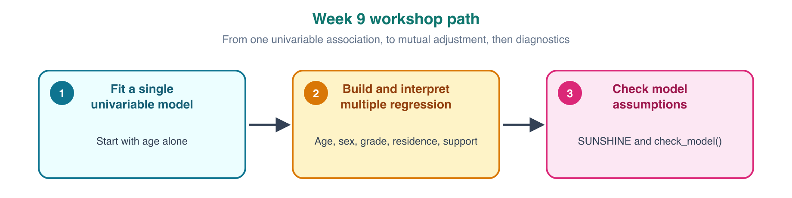
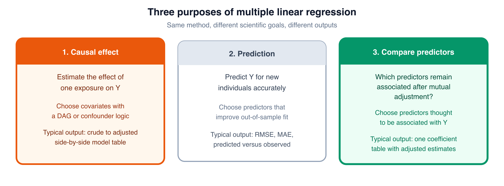
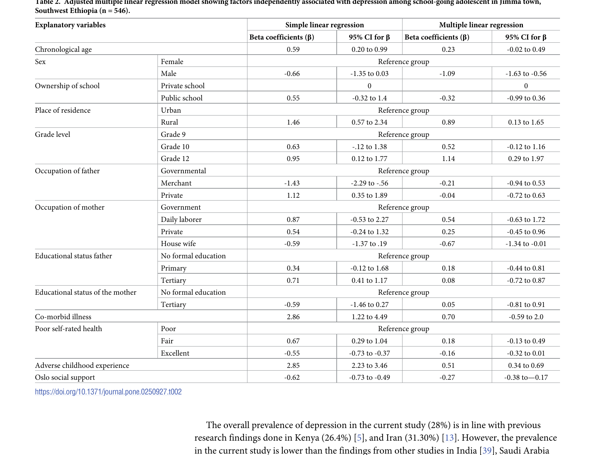
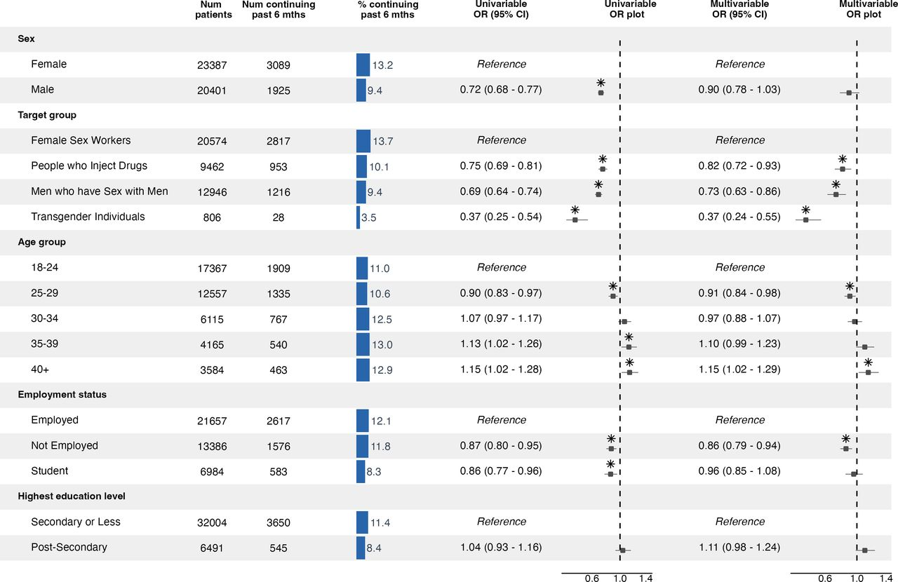

```{r setup, include=FALSE}
knitr::opts_chunk$set(echo = TRUE, message = FALSE, warning = FALSE)
```

# Introduction

The data for this exercise come from a study by Girma et al. (2021) titled *Depression and its determinants among adolescents in Jimma town, Southwest Ethiopia*. You can find the published paper in `paper/depression_paper.pdf` and the analysis dataset in `data/depression_data.xls`.

In Week 7, you worked with this same depression dataset using **simple linear regression**, fitting separate models with a single predictor at a time. This week we extend that approach by fitting a **multiple linear regression** model.

{width=100%}

Our outcome variable is the **PHQ-9 depression score**, which is calculated as the sum of responses across nine items and ranges from 0 to 27, with higher values indicating greater severity of depressive symptoms.


# PART 1: What is our regression purpose?

Multiple linear regression can serve different scientific goals.

{width=100%}

**Question:** In Week 8 we tried to estimate the effect of smoking on FEV, controlling for other confounders. Which of the three purposes above does that correspond to?

Ans:

---

**Question:** This week we will replicate a paper that looked at many different predictors of depression. Which of the three purposes above is that? What kind of table or plot should we probably use for the results?

Ans:

---

# PART 2: Load and prepare the data

## Load packages

Use `p_load()` to load: readxl, tidyverse, here, janitor, broom, gt, gtsummary, performance, see, sandwich, lmtest. The GitHub line below loads `inspectdf`.

```{r load-packages}
if (!require(pacman)) install.packages("pacman")
pacman::p_load(________)
pacman::p_load_gh("the-graph-courses/inspectdf")
```

## Import and clean the dataset

Import the Excel file, then clean and keep only the variables we need.

```{r data-import}
survey_raw <- read_excel(here("data/depression_data.xls"))
```

```{r clean-rename}
# 1. Standardize column names.
# 2. Rename columns to clearer names.
# 3. Keep only: depression_score, chronological_age, sex, grade_level, residence, oslo_social_support.

survey <- survey_raw %>%
  ______() %>%
  ______(
    depression_score = scoredep,
    chronological_age = agechron,
    oslo_social_support = osl3,
    sex = sexrespo,
    residence = residece,
    grade_level = gradelev
  ) %>%
  ______(
    depression_score,
    chronological_age,
    sex,
    grade_level,
    residence,
    oslo_social_support
  )

glimpse(survey)
```

Take a quick look at the data with `inspect_cat()` and `inspect_num()`.

```{r eda-raw}
inspect_cat(survey) %>% show_plot()
inspect_num(survey) %>% show_plot()
```

**Question:** Which variables are numeric, and which look roughly symmetric?

Ans:

---

Four predictors are categorical but stored as numeric codes. Below, we will label them:

- `sex` (0 = Female, 1 = Male)
- `residence` (0 = Urban, 1 = Rural)
- `grade_level` (1 = Grade 9, 2 = Grade 10, 3 = Grade 11, 4 = Grade 12)

We show `sex` as an example. Fill in the blanks for the other two categorical variables.

```{r label}
survey <- survey %>%
  mutate(
    sex = factor(
      sex,
      levels = c(0, 1),
      labels = c("Female", "Male")
    ),
    grade_level = factor(
      grade_level,
      levels = c(1, 2, 3, 4),
      labels = ______
    ),
    residence = factor(
      residence,
      levels = c(0, 1),
      labels = ______
    )
  )
```

Check the labeled data again.

```{r eda-labeled}
inspect_cat(survey) %>% show_plot()
inspect_num(survey) %>% show_plot()
```

# PART 3: Start with univariable models

In the depression paper, the authors fits both univariable and multiple models and presented the results side by side. This is a common practice in regression analyses for comparing predictors. We'll do the same here.

Below, complete the code to fit one univariable model: `depression_score` as the outcome and `chronological_age` as the only predictor.

```{r age-simple}
age_simple <- lm(________ ~ ________, data = survey)
tidy(age_simple, conf.int = TRUE)
```

**Question:** Interpret the age coefficient from the simple model. Does its 95% CI include 0?

Ans:

---

Let's now fit the remaining univariable models. We will combine these with the multiple model in the next part.

```{r all-simple-models}
sex_simple <- lm(depression_score ~ sex, data = survey)
grade_simple <- lm(depression_score ~ grade_level, data = survey)
residence_simple <- lm(depression_score ~ residence, data = survey)
support_simple <- lm(depression_score ~ oslo_social_support, data = survey)
```

# PART 4: Build and interpret a multiple regression

Now, complete the code to fit one multiple linear regression model with all five predictors.

```{r multiple-model}
# Outcome: depression_score
# Predictors: chronological_age, sex, grade_level, residence, oslo_social_support

multivar_model <- lm(
  ________________ ~ ________________,
  data = survey
)

# summary of your model 
summary(________)
```

Now, print the same model in tidy form with confidence intervals.

```{r tidy-multiple}
tidy(multivar_model, conf.int = TRUE)
```

In a multiple model, each coefficient is a **conditional association**. It compares observations that differ on one predictor but are held constant on the other predictors in the model.

**Question:** In the multiple model, interpret `sexMale` using "holding the other predictors constant."

Ans:

---

## Compare the age coefficient in the simple and multiple models

Let's compare the age coefficient in the simple and multiple models.

```{r compare-age}
tidy(age_simple, conf.int = TRUE) %>%
  filter(term == "chronological_age")

tidy(multivar_model, conf.int = TRUE) %>%
  filter(term == "chronological_age")
```

**Question:** What changed when age moved from the simple model to the multiple model?

Ans:

---

Look at how age varies within each grade.

```{r age-by-grade}
survey %>%
  group_by(grade_level) %>%
  summarise(
    n = n(),
    mean_age = mean(chronological_age),
    min_age = min(chronological_age),
    max_age = max(chronological_age),
    .groups = "drop"
  )
```

In the simple model, age compares students across all grades. In the multiple model, the age coefficient compares older versus younger students **within the same grade**, because grade is already in the model. Within each grade, age does not vary much, which is one reason the age association weakens after adjustment.

Another reason is that grade level is largely a consequence of age: students end up in higher grades because they are older. By controlling for grade, we are also removing some of the total effect that age would otherwise carry, since part of age's influence flows through the grade a student has reached.

This overlap is one reason to avoid causal language in this kind of paper. We did not select predictors based on causal reasoning; we are simply comparing their adjusted associations with the outcome.

# PART 5: Build a results table like the paper

Table 2 in the paper shows both univariable and adjusted results side by side. That is what we are trying to reproduce (Caveat: We are only replicating a few of the predictors, and we are acknowledging, as we did last week, that a few of the numbers in the paper are not replicable from the dataset the authors released).



## A quick table with `gtsummary`

The `gtsummary` package can turn a fitted model into a readable table automatically.

```{r gtsummary-demo}
multivar_model %>%
  tbl_regression()
```

This is useful, but it only summarizes one model at a time. It does not let us place univariable and adjusted results side by side in one paper-style table.

For that, we need some custom formatting code. We have prepared this code for you, and as you can see, it is quite intricate. As we have recommended before, for this kind of table-building code, it is probably expedient to lean on LLMs, *as long as you verify that the output tables you receive match the raw outputs from the code you actually understand (your `lm()`, `summary()` and `tidy()` calls).*

```{r helper-functions}
cont_rows <- function(model, var_name, var_label, level_label) {
  tidy(model, conf.int = TRUE) %>%
    filter(term == var_name) %>%
    transmute(
      variable = var_label,
      level = level_label,
      beta = estimate,
      low = conf.low,
      high = conf.high
    )
}

cat_rows <- function(model, var_name, var_label, ref_label) {
  non_ref <- tidy(model, conf.int = TRUE) %>%
    filter(term != "(Intercept)", str_starts(term, var_name)) %>%
    mutate(level = str_remove(term, var_name)) %>%
    transmute(
      variable = var_label,
      level,
      beta = estimate,
      low = conf.low,
      high = conf.high
    )

  ref <- tibble(
    variable = var_label,
    level = ref_label,
    beta = 0,
    low = NA_real_,
    high = NA_real_
  )

  bind_rows(ref, non_ref)
}

format_beta_ci <- function(beta, low, high) {
  if_else(
    is.na(low),
    "Reference",
    paste0(
      format(round(beta, 2), nsmall = 2), " (",
      format(round(low, 2), nsmall = 2), " to ",
      format(round(high, 2), nsmall = 2), ")"
    )
  )
}
```

Build simple and adjusted rows, then combine them into one table.

```{r simple-results}
simple_results <- bind_rows(
  cont_rows(age_simple, "chronological_age", "Chronological age", "Per 1-year increase"),
  cat_rows(sex_simple, "sex", "Sex", ref_label = "Female"),
  cat_rows(grade_simple, "grade_level", "Grade level", ref_label = "Grade 9"),
  cat_rows(residence_simple, "residence", "Place of residence", ref_label = "Urban"),
  cont_rows(support_simple, "oslo_social_support", "Oslo social support", "Per 1-point increase")
) %>%
  mutate(model = "Simple")
```

```{r adjusted-results}
adjusted_results <- bind_rows(
  cont_rows(multivar_model, "chronological_age", "Chronological age", "Per 1-year increase"),
  cat_rows(multivar_model, "sex", "Sex", ref_label = "Female"),
  cat_rows(multivar_model, "grade_level", "Grade level", ref_label = "Grade 9"),
  cat_rows(multivar_model, "residence", "Place of residence", ref_label = "Urban"),
  cont_rows(multivar_model, "oslo_social_support", "Oslo social support", "Per 1-point increase")
) %>%
  mutate(model = "Multiple")
```

```{r combined-table}
combined_results <- bind_rows(simple_results, adjusted_results) %>%
  mutate(`Beta (95% CI)` = format_beta_ci(beta, low, high)) %>%
  select(variable, level, model, `Beta (95% CI)`)

combined_results %>%
  pivot_wider(names_from = model, values_from = `Beta (95% CI)`) %>%
  gt(groupname_col = "variable", rowname_col = "level") %>%
  tab_header(
    title = "Factors associated with PHQ-9 depression score",
    subtitle = "Simple and multiple linear regression"
  ) %>%
  tab_style(style = cell_text(weight = "bold"), locations = cells_row_groups()) %>%
  tab_options(table.width = pct(100))
```

**Question:** Which adjusted 95% CIs exclude 0?

Ans:

---

# PART 6: Regression diagnostics

We will now check whether the model assumptions look reasonable. The diagram below shows some of the checks that we will perform. If you want a more detailed refresher on what each diagnostic panel means, see the [Regression Diagnostics Explorer](https://the-graph-courses.github.io/rsr_resources/explorers/regression-diagnostics).

{width=100%}

## Sample size and design checks

**Question:** Our final model has how many parameters? (This is the number of coefficient rows in the model output, including the intercept.)

Ans:

---

**Question:** Based on the guideline that we should have at least 10 observations per parameter, do we have enough data to be fitting such a regression model?

Ans:

---

**Question:** Students were sampled from a few schools. There may be some correlation of outcomes, and therefore residuals, within schools. Which SUNSHINE letter might be most affected by this?

Ans:

---

The usual fix for this kind of within-cluster correlation is to compute cluster-robust standard errors, using school as the clustering variable. However, the released dataset does not include a school identifier, so we have no way to group students by school and cannot compute those cluster-robust SEs here. This is worth flagging as a limitation when reporting the results: our standard errors may be too small because we could not account for clustering by school.

## Run `check_model()`

Now, let's run the full diagnostic panel for the checks that can be performed visually.

```{r check-model, fig.width=10, fig.height=8}
check_model(multivar_model)
```

Use the plots to answer the questions below.

**Question:** Which predictors show the highest collinearity? Is it severe?

Ans:

---

**Question:** How would you read the linearity, homogeneity, influential-observations, and normality panels?


Linearity:

Homogeneity:

Influential observations:

Normality:

## Formal follow-up checks

From the plots above, the two assumptions that look most worrying are **homogeneity of variance** and **normality of residuals**. Let's check those formally below.

```{r check-heteroscedasticity}
check_heteroscedasticity(multivar_model)
```

Because heteroscedasticity is flagged, let's calculate heteroscedasticity-robust standard errors as a sensitivity check. We use HC3 robust SE here. Cluster-robust SE would require a real clustering variable, such as school ID, which is not in this reduced workshop dataset.

```{r robust-se}
coeftest(multivar_model, vcov. = vcovHC(multivar_model, type = "HC3"))
```

**Question:** Earlier we found that sex, Grade 12, rural residence, and Oslo social support had adjusted 95% CIs that excluded 0. Using the robust standard errors, are these same predictors still significantly associated with depression score?

Ans:

(If the main conclusions do not change, it is still acceptable to report your original SEs. You may choose to report the assumptions figure and these heteroscedasticity-robust SEs in supplementary material so readers can keep them in mind.)

---

```{r check-normality}
check_normality(multivar_model)
```

The check identifies significant deviations from normality. However, in practice, normality of residuals is usually the least important assumption when the sample size is in the hundreds, as it is here. So it is not a major concern.

# Optional challenge: forest plot with LLM help

Some papers combine a coefficient table with a forest plot in one figure. Try to replicate that style for your simple-versus-multiple results, using **ggplot2** and **patchwork**. An LLM can help with the code.

For inspiration, see Fig 2 here: <https://gh.bmj.com/content/10/12/e018739#F2>



You can also look at this script for code you might adapt: <https://github.com/kendavidn/yaounde_serocovpop_shared/blob/v1.0.0/scripts/infection_regn_2.R>

```{r forest-plot-challenge}
# Your code here
```

