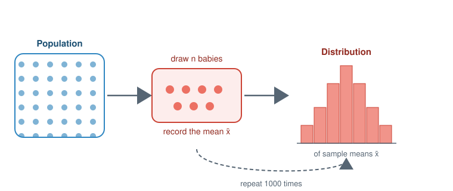
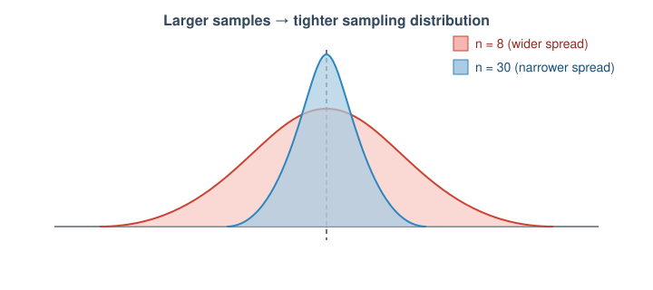

# Introduction

Welcome to Workshop 3! In this workshop you will practice applying the concepts of the Normal Distribution, Z-scores, and Sampling Distributions using a real dataset of births in the US in 2014.

This week's pre-work lessons covered:

- The Normal Distribution and Z-scores
- Sampling Distributions and the Central Limit Theorem

# Dataset: US Births in 2014

Today we will use a dataset containing records of births in the United States in 2014. We will focus specifically on **birth weight** of full-term babies.

The data come from the CDC National Center for Health Statistics and cover nearly **4 million births** registered across the United States in 2014. Because this is essentially *every* birth that year rather than a small sample, we can treat the whole dataset as our **population** of interest. You can [read more about the source data here](https://www.cdc.gov/nchs/data_access/VitalStatsOnline.htm).

## Load packages and data

For this workshop you will need the packages below. Run the chunk to load them:

```{r setup, message=FALSE, warning=FALSE}
if (!require(pacman)) install.packages("pacman")
pacman::p_load(tidyverse, here, janitor)
```

Load the `births_2014.csv.gz` file and assign it to an object called `births_raw`. 

```{r}
births_raw <- read_csv("births_2014.csv.gz")
```

## Data Preparation

The original `weight` variable is in pounds. We also have a `premie` column where `0` means full-term and `1` means premature. 
Let's filter for only full-term babies (premie == 0) and convert the weight to kilograms.

```{r}
births <- births_raw %>%
  filter(premie == 0) %>% 
  mutate(weight_kg = weight * 0.453592) %>% 
  drop_na(weight_kg)

head(births)
```

# Part 1: The Normal Distribution of Birth Weights

Before diving into individual probabilities, let's look at the overall distribution of birth weights for full-term babies. We can plot a histogram to check for normality.

```{r}
ggplot(births, aes(x = weight_kg)) +
  geom_histogram(bins = 40, fill = "lightblue", color = "white") +
  theme_minimal() +
  labs(title = "Distribution of Full-Term Birth Weights (2014)",
       x = "Weight (kg)",
       y = "Count")
```

::: {.callout-tip title="Q1a"}
Does the distribution look approximately normal (bell-shaped)?

**Ans:** Yes, it looks approximately normal. It has a single peak in the center and falls off symmetrically on both sides, creating a characteristic bell shape.
:::

Since we have data for nearly all US births in 2014, we can treat this dataset as our **population**. Let's calculate the population mean ($\mu$) and population standard deviation ($\sigma$).

```{r}
pop_mean <- mean(births$weight_kg)
pop_sd <- sd(births$weight_kg)

pop_mean
pop_sd
```

**Note:** The mean should be about 3.37 kg, and the SD about 0.47 kg.

## How unusual is a low birth weight baby?

Late in a pregnancy, a doctor does an ultrasound and estimates the baby will weigh about **2.1 kg** at birth. They wonder whether they should flag this as a concern. Is **2.1 kg** unusually low for a full-term baby? 

A **z-score** answers this by measuring how many standard deviations a value sits from the mean.

First, calculate the **z-score** for this baby. Remember the formula: $Z = \frac{x - \mu}{\sigma}$

```{r}
z_light <- (2.1 - pop_mean) / pop_sd
z_light
```

::: {.callout-tip title="Q1b"}
What does this z-score tell you about how far this baby's weight is from the mean?

**Ans:** The z-score is approximately -2.68, which means this baby's weight is about 2.68 standard deviations *below* the population mean. This is quite far from the average.
:::

::: {.callout-note title="Illustration"}


*A z-score measures how many standard deviations a value lies from the mean. Here 2.1 kg sits about 2.7 SDs into the left tail.*
:::

Next, use the `pnorm()` function to calculate the exact proportion of babies weighing *less* than 2.1 kg in a normal distribution with our population mean and SD.

```{r}
prop_less_2.1 <- pnorm(q = 2.1, mean = pop_mean, sd = pop_sd)
prop_less_2.1
```

Because we actually have the full population data, we don't just have to rely on `pnorm()`. We can directly count what proportion of babies in our dataset weighed less than 2.1 kg!

```{r}
births %>% 
  mutate(below_2.1 = weight_kg < 2.1) %>% 
  tabyl(below_2.1) %>% 
  adorn_pct_formatting()
```

::: {.callout-tip title="Q1c"}
How does the theoretical probability from `pnorm()` compare to the actual proportion we calculated from the data using `tabyl()`?

**Ans:** The theoretical probability from `pnorm()` is very similar to the actual proportion calculated from the data. Both indicate that about half a percent of full-term babies weigh less than 2.1 kg.
:::


## Practice: How unusual is a heavy baby?

Another expectant mother's scan suggests her baby is tracking large, around **4.4 kg**. Is that unusually heavy for a full-term baby, heavy enough that the doctor might want to prepare for a more complicated delivery? Let's do the same calculations for a baby weighing **4.4 kg**.

Calculate the z-score:
```{r}
z_heavy <- (4.4 - pop_mean) / pop_sd
z_heavy
```

Calculate the proportion of babies weighing **MORE** than 4.4 kg using `pnorm()`. 
*Hint: `pnorm()` gives you the area to the left (less than). How do you find the area to the right (more than)?*

```{r}
prop_more_4.4 <- 1 - pnorm(q = 4.4, mean = pop_mean, sd = pop_sd)
prop_more_4.4
```

Verify it against the actual data using `tabyl()`:

```{r}
births %>% 
  mutate(above_4.4 = weight_kg > 4.4) %>% 
  tabyl(above_4.4) %>% 
  adorn_pct_formatting()
```


# Part 2: Sampling Distributions (Small Sample)

In Part 1, we asked if a *single baby* was unusual. But what if we want to know if a *group of babies* is unusual?

The key shift is that we no longer look at one baby. Instead we take a whole **sample** of babies from the **population** and summarise it with a single number: the sample mean. The distribution of this sample mean is called a **sampling distribution**.

::: {.callout-note title="Illustration"}


*Repeatedly draw a sample, record its mean, and collect those means into their own distribution.*
:::

## Illustrative hospital data (Flint-inspired scenario)

In 2014, Flint, Michigan switched its public water source, which led to a well-documented public health crisis. Researchers later linked the crisis to worse birth outcomes using **CDC natality records** and city-level statistical methods (for example, [Wang et al., 2021](https://link.springer.com/article/10.1007/s00148-021-00876-9)).

Below, we use a small synthetic sample of weights inspired by that real-world context to illustrate the concepts of sampling distributions.

Imagine a doctor at a hospital in Flint noticed what seemed like lighter-than-usual full-term babies and pulled the weights from their last 8 full-term deliveries:

```{r}
flint_small <- tibble(weight_kg = c(3.0, 3.3, 2.8, 3.7, 3.2, 3.2, 3.3, 2.7))
mean_flint_small <- mean(flint_small$weight_kg)
mean_flint_small
```

The mean of these 8 babies is `r round(mean_flint_small, 2)` kg. This is lower than the national average of 3.37 kg. 

But is it *unusually* low? To answer this, we need to know what kind of sample means we would get just by random chance. We can build a **sampling distribution** by drawing random samples of size $n=8$ from our population over and over again, recording the mean each time.

```{r}
set.seed(123) # for reproducibility

sim_data_8 <- tibble(
  mean = replicate(1000, mean(sample(births$weight_kg, 8)))
)

# Plot the sampling distribution
ggplot(sim_data_8, aes(x = mean)) +
  geom_histogram(binwidth = 0.025, fill = "#f5b7b1") +
  geom_vline(xintercept = mean_flint_small, color = "#34495e") +
  coord_cartesian(xlim = c(2.8, 3.9)) +
  labs(title = "Sample Means (n=8)", x = "Mean (kg)", y = "Count")
```

## How unusual was the doctor's sample?

Let's see exactly what proportion of our 1000 random samples had a mean as low as (or lower than) the hospital sample mean:

```{r}
sim_data_8 %>% 
  mutate(below_flint = mean < mean_flint_small) %>% 
  tabyl(below_flint) %>% 
  adorn_pct_formatting()
```

::: {.callout-tip title="Q2a"}
Based on this simulation, is a sample mean of `r round(mean_flint_small, 2)` highly unusual for a sample of 8 babies? Should the doctor be extremely worried yet?

**Ans:** Based on the simulation, around 10% of random samples of size 8 naturally have a mean this low or lower. While it's on the lower side, it is not highly unusual. The doctor may not yet have enough reason to be worried based solely on this small sample of 8 babies.
:::

# Part 3: Sampling Distributions (Larger Sample)

The doctor decides to collect more data. They gather weights for 30 full-term babies in total:

```{r}
flint_large <- tibble(weight_kg = c(3.0, 3.3, 2.8, 3.7, 3.2, 3.2, 3.3, 2.7,
                                    3.1, 2.9, 3.7, 3.4, 3.5, 2.5, 3.0, 3.3,
                                    2.0, 3.4, 3.0, 3.2, 2.7, 4.4, 3.0, 2.6,
                                    3.6, 2.8, 3.2, 3.5, 3.4, 3.9))

mean_flint_large <- mean(flint_large$weight_kg)
mean_flint_large
```

The new mean is roughly the same: `r round(mean_flint_large, 2)` kg. But now the sample size is larger ($n=30$). 

Let's build a new sampling distribution for $n=30$.

```{r}
set.seed(123)
sim_data_30 <- tibble(
  mean = replicate(1000, mean(sample(births$weight_kg, 30)))
)

# Plot the new sampling distribution
ggplot(sim_data_30, aes(x = mean)) +
  geom_histogram(binwidth = 0.025, fill = "#a9cce3") +
  geom_vline(xintercept = mean_flint_large, color = "#34495e") +
  coord_cartesian(xlim = c(2.8, 3.9)) +
  labs(title = "Sample Means (n=30)", x = "Mean (kg)", y = "Count")
```

Check the proportion of random samples with a mean below the hospital's larger sample mean:

```{r}
sim_data_30 %>% 
  mutate(below_flint = mean < mean_flint_large) %>% 
  tabyl(below_flint) %>% 
  adorn_pct_formatting()
```

::: {.callout-tip title="Q3a"}
Compare the sampling distribution for $n=8$ and the sampling distribution for $n=30$. What happens to the "spread" (width) of the distribution as the sample size increases?

**Ans:** As the sample size increases from $n=8$ to $n=30$, the spread (width) of the sampling distribution decreases. The sample means are clustered much more tightly around the true population mean.
:::


::: {.callout-tip title="Q3b"}
Is the hospital sample mean now considered unusually low? Why is it more unusual now even though the sample mean value barely changed?

**Ans:** Yes, it is now considered unusual relative to the national sampling distribution. Because the sampling distribution for $n=30$ is much narrower, it's significantly rarer to randomly draw a sample with a mean that is that far below the national average. What was plausible chance for 8 babies is highly unlikely for 30 babies. Remember that this is still a teaching scenario; real Flint studies used city-wide data and found more modest changes.
:::

::: {.callout-note title="Illustration"}


:::

# Part 4: Standard Error and the t-statistic

So far, we have answered the question "is this sample mean unusually low?" by simulating many random samples from the full 2014 births dataset. That worked because, for this workshop, we have the whole population available.

In most real studies, we do not have the whole population. We might only have one sample, like the 30 hospital births. Instead of simulating thousands of samples, we can use a formula to estimate how much sample means usually vary.

That typical variation is called the **Standard Error (SE)**. You can think of it as the standard deviation of the sampling distribution: a small SE means sample means tend to cluster tightly around the population mean; a large SE means they are more spread out.

The formula is: $SE = \frac{\sigma}{\sqrt{n}}$

Here, $\sigma$ is the population standard deviation and $n$ is the sample size.

Since we usually don't know the population standard deviation $\sigma$, we estimate it using our sample's standard deviation ($s$).

## Estimating the standard error

Calculate the estimated Standard Error for the `flint_large` sample ($n=30$):

```{r}
se_flint <- sd(flint_large$weight_kg) / sqrt(30)
se_flint
```

## From standard error to a t-score

Now we can turn the hospital's sample mean into a **t-score**. This is like a z-score, but for a sample mean instead of one individual baby. It tells us how many standard errors the hospital mean is below the national mean.

Formula: $t = \frac{\bar{x} - \mu}{SE}$

```{r}
t_score <- (mean_flint_large - pop_mean) / se_flint
t_score
```

## Getting a p-value with `pt()`

Finally, we use `pt()` to turn the t-score into a p-value. This gives us the same kind of answer as the simulation: the probability of getting a sample mean this low (or lower) by chance. For a t-distribution, we also need the degrees of freedom, which is $n - 1$.

```{r}
p_value <- pt(q = t_score, df = 30 - 1)
p_value
```

::: {.callout-tip title="Q4a"}
How does this mathematically calculated p-value compare to the proportion you found in your simulation in Part 3?

**Ans:** They are very close. The mathematically calculated p-value (around 0.014) is almost identical to the proportion we found in our simulation (around 2%). 

The small remaining difference comes from the t-test relying on the sample's standard deviation to estimate the (unknown) population standard deviation, plus the randomness in our 1000 simulated samples.
:::

## The easy way: `t.test()`

You don't have to do this by hand every time. The procedure we have just gone through is equivalent to running a one-sample t-test, and R has a built-in function called `t.test()` that does all of this for you!

Run a one-sample t-test to see if the `flint_large` sample mean is significantly *less* than the national population mean.

```{r}
t.test(flint_large$weight_kg, mu = pop_mean, alternative = "less")
```

Examine the output.  

::: {.callout-tip title="Q4b"}
Do the `t` statistic and `p-value` reported by `t.test()` match the `t_score` and `p_value` you calculated by hand?

**Ans:** Yes. The `t.test()` output reports essentially the same t-statistic and p-value that we calculated manually. Any tiny differences are just due to rounding.
:::

::: {.callout-tip title="Q4c"}
In your own words, what do the `t` statistic and the `p-value` in this output represent?

**Ans:** The t-statistic tells us how many standard errors the sample mean lies below the national population mean. The p-value is the probability of seeing a sample mean this low (or lower) purely by chance if the true mean of this dataset really were the national average. 

Because it is small (about 0.014), a sample mean this low would be quite unlikely under chance alone, which is evidence that this hospital sample is lighter than the national average in our exercise.
:::

# Wrap up

You've successfully:

- Checked a population for normality and calculated probabilities with `pnorm()`
- Standardized values using Z-scores
- Simulated sampling distributions using `replicate()`
- Demonstrated the Central Limit Theorem by comparing distributions for $n=8$ and $n=30$
- Calculated Standard Errors and t-statistics by hand
- Run a formal one-sample t-test using `t.test()`
- Connected the hospital example to real Flint water crisis research, while using illustrative weights for practice

Great work! Save and submit your Qmd.
